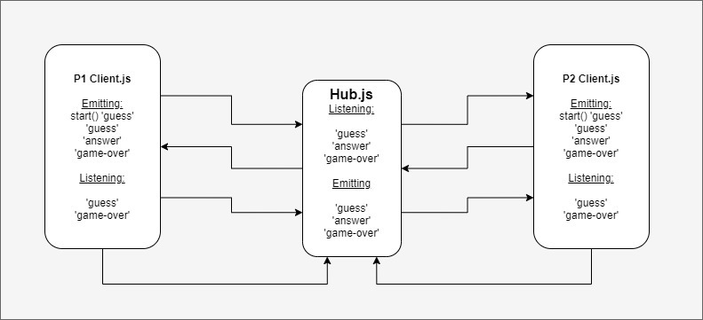

# Sinky Ship

## Overview

- Plan, Execute, and Present an application that showcases an event driven architecture.

The application simulates a simple game of battle ship, played between two clients through a hub. Each 'player' takes turns guessing random coordinates and emitting their guess to the hub which logs the guess and broadcasts it to the opposing 'player'. That player receives the guess and checks to see if it hit their ship or not and emits a "HIT!!" or "MISS" back to the hub to log. After a short interval that play emits a guess of their own to the hub, which is logged, and in turn broadcast to the orignal player. This proceeds until one or the other ships is sunk at which point the 'game-over' event is emitted to the hub where it is logged and the program is ended.

## Authors: Jason Dormier & William Moreno

## Dependencies / Getting Started

Clone the repository

run `npm install` in the `hub`, `p1` and `p2` directories in the terminal

In separate terminals navigate to caps directory and run the following commands in order:

1. `node /hub/hub.js`
1. `node /p2/client.js`
1. `node /p1/client.js`

## Working Features

- Created `hub.js` as the server for the application
- Created `client.js` client files for p1 and p2 
- Connected server and clients using socket.io
- Created emitters and listeners for events:
  - `'guess'` - to generate and publish a unique random guess
  - `'answer'` - after comparing a received guess and comparing it to the position of the ship publish either a hit or a miss
  - `'game-over'` - when a player's ship has taken all four hits it publishes this event to the hub to end the game
- created logic to generate and track guesses made by the player and tracks hits that each ship has taken

## UML

